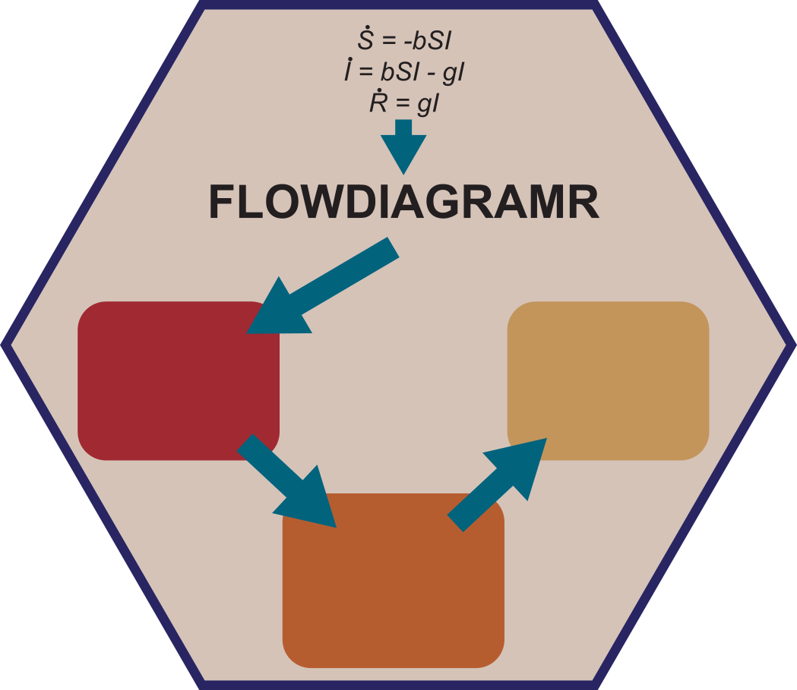

<!-- README.md is generated from README.Rmd. Please edit that file -->

```{r, echo = FALSE}
knitr::opts_chunk$set(
  collapse = TRUE,
  comment = "#>",
  fig.path = "man/figures/"
)
```

# flowdiagramr 


<!-- badges: start -->
[](https://github.com/andreashandel/flowdiagramr/actions)
[](https://codecov.io/gh/andreashandel/flowdiagramr)
[](https://github.com/andreashandel/flowdiagramr/actions)
[](https://github.com/andreashandel/modeldiagram/actions)
<!-- badges: end -->

**This package is still under early, active development. If you see this message, assume that several parts of the package don't quite work yet.**

## Description
This package allows automated creation of flow diagrams for compartmental simulation models using ggplot. Other types of flow charts are also supported.

## Getting Started


For an introduction to the package, step-by-step instructions on getting started, and more information on the different ways you can use the package [see the _Quick Start_ tutorial (vignette)](https://andreashandel.github.io/flowdiagramr/articles/A_quickstart.html).


## Further information
 

## Citation and Contributors

This R package was developed by [Andrew Tredennick]( https://atredennick.github.io/) and [Andreas Handel](https://www.andreashandel.com/). It is maintained Andreas Handel. A full list of contributors and a Bibtex entry for the citation [can be found here](https://andreashandel.github.io/flowdiagramr/authors.html).

This project was/is partially supported by NIH grants R01 GM124280 and GM 12480-03S1. 
