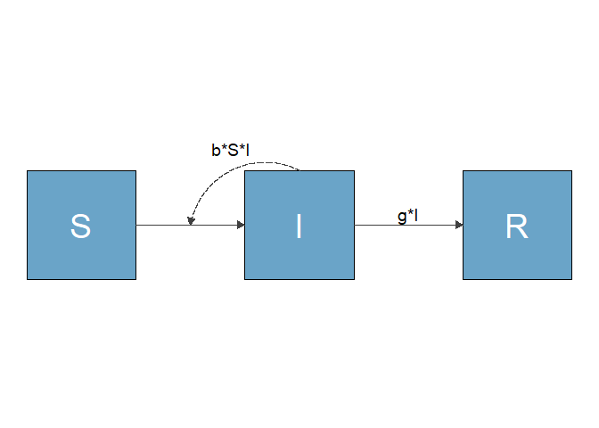

<!-- README.md is generated from README.Rmd. Please edit that file -->

# flowdiagramr 

<!-- badges: start -->

[](https://github.com/andreashandel/flowdiagramr/actions)
[](https://github.com/andreashandel/flowdiagramr/actions)
[](https://codecov.io/gh/andreashandel/flowdiagramr?branch=main)
<!-- badges: end -->

**This package is still under active development. If you see this
message, assume that several parts of the package don’t quite work
yet.**

## Description

**flowdiagramr** allows automated creation of flow diagrams for
compartmental simulation models using ggplot. Other types of flow charts
are also supported.

## Quick example

These few lines of code create a simple diagram of and SIR model using
**flowdiagramr**

``` r
#install if needed - package is not yet on CRAN
# remotes::install_github('andreashandel/flowdiagramr')
library(flowdiagramr)
#specify model
mymodel = list( varlabels = c("S","I","R"),
                flows = list(S_flows = c("-b*S*I"), 
                             I_flows = c("b*S*I","-g*I"), 
                             R_flows = c("g*I"))
              )
#prepare diagram
diagram_list <- prepare_diagram(mymodel)
#make diagram
my_diagram <- make_diagram(diagram_list)
#plot diagram
plot(my_diagram)
```

<!-- -->

## Getting Started

If you think something like this is of interest to you, hop on over to
the [*Quick Start* tutorial
(vignette)](https://andreashandel.github.io/flowdiagramr/articles/A_quickstart.html).

## Further information

**flowdiagramr** gives you many options to easily customize diagrams.
You can also make diagrams that are not based on compartmental models.
To explain (most) everything **flowdiagramr** can do, we wrote several
tutorials/vignettes. Here they are listed for convenience.

**Main tutorials/vignettes**

*You should go through them in this order*

1.  [Quick start
    guide](https://andreashandel.github.io/flowdiagramr/articles/A_quickstart.html)
2.  [Basic modification of
    diagrams](https://andreashandel.github.io/flowdiagramr/articles/B_modify_diagrams_simple.html)
3.  [Modifying the input
    structure](https://andreashandel.github.io/flowdiagramr/articles/C_modify_input_structure.html)
4.  [Modifying the ggplot2
    code](https://andreashandel.github.io/flowdiagramr/articles/D_modify_ggplot_code.html)

**Additional tutorials/vignettes**

*Read them based on interest, in any order*

- [More model
  examples](https://andreashandel.github.io/flowdiagramr/articles/E_non_model_diagrams.html)
- [Making non-model based
  diagrams](https://andreashandel.github.io/flowdiagramr/articles/F_more_model_examples.html)
- [Some additional
  topics](https://andreashandel.github.io/flowdiagramr/articles/G_additional_topics.html)
- [Comparison to other R
  packages](https://andreashandel.github.io/flowdiagramr/articles/H_comparison_to_other_packages.html)

The package website (if you are not already on it) is
[here.](https://andreashandel.github.io/flowdiagramr/) You can access
all the tutorials from there, as well as some additional information.

## Citation and Contributors

This R package was developed by [Andrew
Tredennick](https://atredennick.github.io/) and [Andreas
Handel](https://www.andreashandel.com/). A full list of contributors and
a Bibtex entry for the citation [can be found
here](https://andreashandel.github.io/flowdiagramr/authors.html).

This project was/is partially supported by NIH grants R01 GM124280 and
GM 12480-03S1.
