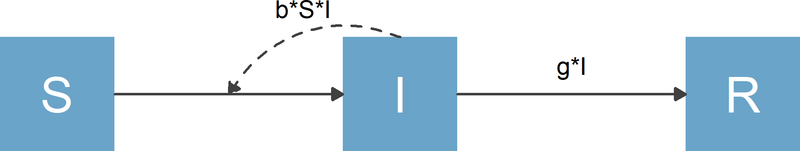

## Motivation

* Many areas of science use models that can be represented by variables (compartments/nodes) and flows (processes).

* Flow diagrams are often good ways to communicate these models.

<div class="centered">
[SIR model as example](https://en.wikipedia.org/wiki/Compartmental_models_in_epidemiology)
</div>

::::{.columns}
:::{}
$$
\begin{aligned}
\dot S & = - b S I \\ 
\dot I & = b S I - g I \\
\dot R & = g I 
\end{aligned}
$$
:::
:::{}

```{r,  echo=FALSE, fig.cap='SIR model', out.width = '60%'}

```
:::
::::


## Motivation

* Generally, one needs to create such diagrams manually using some type of graphical software.
* We wanted to provide a way to produce nice diagrams with a few lines of R code. 
* We also wanted the ability to fully customize the plots if needed, and to make plots using ggplot2. 
* Our ([Andrew Tredennick](https://atredennick.github.io/) and [Andreas Handel](https://www.andreashandel.com/)) new package **[flowdiagramr](https://andreashandel.github.io/flowdiagramr/)** allows one to do that.


## flowdiagramr basics

Specify a model:

```{r}
library(flowdiagramr)
varlabels = c("S","I","R")
flows     = list(S_flows = c("-b*S*I"), 
                 I_flows = c("b*S*I","-g*I"), 
                 R_flows = c("g*I"))
sirmodel = list(varlabels = varlabels, flows = flows)
```

## flowdiagramr basics

Let **flowdiagramr** turn it into a nice diagram (in 2 steps):

```{r}
# prepare diagram
sir_diagram_list <- prepare_diagram(sirmodel)
# make diagram
sir_diagram <- make_diagram(sir_diagram_list)
plot(sir_diagram)
```


## Customize your diagram

Specify settings to be passed to `make_diagram`

```{r}
sir_diagram_settings <- list(
    node_outline_color = "black",
    node_fill_color = c("#6aa4c8", "#eb5600", "#1a9988"),
    node_text_color = "black",
    node_text_size = 14,
    flow_text_color = "black",
    flow_text_size = 8,
    main_arrow_color = "blue",
    main_arrow_linetype = "solid",
    main_arrow_size = 1,
    interaction_arrow_color = "red",
    interaction_arrow_linetype = "dashed",
    interaction_arrow_size = 0.7)
```


## Customize your diagram

Create diagram with customized settings

```{r}
sir_diagram <- make_diagram(sir_diagram_list, sir_diagram_settings)
plot(sir_diagram)
```


## More customizations

You can provide variable names and locations.

```{r}
varlabels = c("S","I","R")
varnames  = c("Susceptible","Infected","Recovered")
flows     = list(S_flows = c("n", "-b*S*I", "-m*S"), 
                 I_flows = c("+b*S*I","-g*I", "-m*I"), 
                 R_flows = c("g*I", "-m*R"))
varlocations = matrix(data = c("S", "", "R",
                               "", "I", "" ),
                      nrow = 2, ncol = 3, byrow = TRUE)
sirmodel2 = list(varlabels = varlabels, flows = flows, 
                 varnames = varnames, varlocations = varlocations)
```


## More customizations

```{r}
sir_diagram_list2 <- prepare_diagram(sirmodel2)
sir_diagram2 <- make_diagram(sir_diagram_list2)
plot(sir_diagram2)
```


## More customizations

You can combine location specification with user-supplied settings for `make_diagram`

```{r}
sir_diagram_settings2 = c(sir_diagram_settings, 
                          use_varnames = TRUE, 
                          node_text_size = 4)
sir_diagram3 <- make_diagram(sir_diagram_list2, 
                             sir_diagram_settings2)
```
## More customizations

You can combine location specification with user-supplied settings for `make_diagram`

```{r}
plot(sir_diagram3)
```


## Even more customization {.smaller}

* `prepare_diagram` returns a list of data frames that specify variables/compartments/boxes and flows/arrows.

```{r}
print(sir_diagram_list2)
```


## Even more customization

* You can edit the object produced by `prepare_diagram` before calling `make_diagram`.

```{r}
#assign to a new variable so we preserve the original
modified_diagram_list <- sir_diagram_list2
#increase the I box a bit both on left and right 
modified_diagram_list$nodes$xmin[2] = 5
modified_diagram_list$nodes$xmax[2] = 7
#modify inflow and outflow arrows to align with new box size 
modified_diagram_list$horizontal_edges$xend[1] = 5
modified_diagram_list$horizontal_edges$xstart[2] = 7
#move the b*S*I arrow end a bit
modified_diagram_list$curved_edges$xend[1] = 4
#move the b*S*I label 
modified_diagram_list$curved_edges$labely[1] = 0.2
modified_diagram_list$curved_edges$labelx[1] = 4.6
#move the g*I arrow over just a bit
modified_diagram_list$horizontal_edges$labelx[2] = 7.75
```


## Even more customization

With those modifications, the resulting diagram looks like this

```{r}
sir_diagram4 <- make_diagram(modified_diagram_list)
plot(sir_diagram4)
```


## Get the full code to reproduce the diagram

* **`flowdiagramr`** can produce a stand-alone script with all `ggplot2` code.

```{r, eval = FALSE}
write_diagram(sirmodel, filename ="sirmodel_diagram_code.R")
```

* You can run the code to reproduce the figure in a stand-alone manner. You can also fully edit the code to make any tweaks you like.


## Further Resources

The [**`flowdiagramr`** website](https://andreashandel.github.io/flowdiagramr/) provides a lot of additional information (https://andreashandel.github.io/flowdiagramr/):

* Many examples illustrating options for customization.
* Explanation for making non-model based flow diagrams.
* Comparison to other R packages (e.g. `DiagrammeR`).
* And much more `r emo::ji('smile')`

**Feedback is appreciated:** 

* Web: www.andreashandel.com 
* Email: ahandel@uga.edu 
* Twitter: @andreashandel


