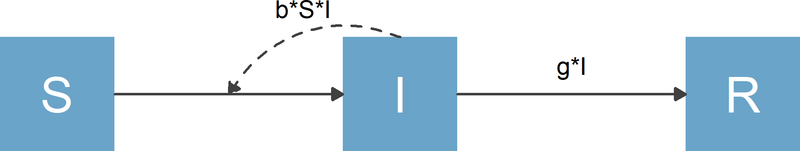

```{r, include = FALSE}
knitr::opts_chunk$set(
  collapse = TRUE,
  comment = "#>",
  fig.width = 7
)

# avoid check where vignette filename must equal the vignette title
options(rmarkdown.html_vignette.check_title = FALSE)
```

```{r setup, include = FALSE}
pkg = 'flowdiagramr' #so we can easily switch names
library(pkg, character.only = TRUE)
```

## Overview

**`r pkg`** is designed to create nice-looking diagrams for compartmental simulation models and other kinds of scenarios where a model with compartments/nodes and flows/connections is needed. The user provides the compartments and the flows, and gets as return a model diagram in ggplot format, as well as code that created the diagram and can be further modified.


## Terminology

The kinds of models and diagrams we are discussing here are used in many different areas of science. That also means there are many different ways and words to describe these models. What we mainly refer to as _compartments_ or _variables_ is also known as _stocks_ or _nodes_. Similarly, what we mainly refer to as _flows_ or _processes_ is also known as _connections_ or ... We hope by showing examples it will be clear.


## Starting Example

Here is a simple example to illustrate the process. This is the [Susceptible-Infected-Recovered (SIR) model](https://en.wikipedia.org/wiki/Compartmental_models_in_epidemiology) which forms the basis of many models used in infectious disease epidemiology. For this model, we have 3 compartments/variables, name susceptible individuals, **S**, infected/infectious individuals, **I**, and recovered/removed individuals, **R**. We also have 2 processes/flows, one process by which susceptible individuals become infected at some rate after contact with infectious individuals, __b\*S\*I__ and a process by which infected individuals recover at some rate, __g\*I.__

Written out as differential equations, the model looks like this

$$
\begin{aligned}
\dot S & = - b S I \\ 
\dot I & = b S I - g I \\
\dot R & = g I 
\end{aligned}
$$

A diagram for the model looks as follows

```{r sirdiagram,  fig.cap='',  echo=FALSE, out.width = "70%"}

```

The purpose of **`r pkg`** is to automatically create this diagram for you if you supply the model specification. Here is how.

### Specify the model

**`r pkg`** wants the model input as a simple list structure. This list needs to have a minimum of 2 elements, the variable/compartment labels and the processes/flows for each compartment. For the model above, this structure would look as follows:

```{r}
varlabels = c("S","I","R")
flows = list(S_flows = c("-b*S*I"), 
             I_flows = c("b*S*I","-g*I"), 
             R_flows = c("g*I"))
mymodel = list(varlabels = varlabels, flows = flows)
```

Note that the main list (called `mymodel` above) can have any name, but the elements inside the list need to be called `varlabels` and `flows`. Also, the flows for each variable need to be named `X_flows` where X corresponds to the variable label (this doesn't have to be a single letter). Finally, the flows need to be provided as valid mathematical expressions, so you need to write `b*S*I`, writing it as `bSI` will not work.

In addition to the required two list elements, you can specify a few optional list elements, which we'll discuss later. 


### Create elements needed for diagram generation

Once you specified your model in the list structure just described, the next step is to process the model, then make the diagram. This happens in two steps, which as the advantage of easier manual modification. You'll learn more about that in subsequent vignettes. For now, we just show the steps, then revisit them later. 

To get ready for diagram generation, you send your model to the `prepare_diagram` function.

```{r}
input_structure <- prepare_diagram(mymodel)
```

The `input_structure` object returned by this function contains a list of data frames used to make the diagram. We'll skip over this for now and revisit it in a later vignette.


### Make the diagram 

Now it's time to make the diagram. This is done by sending the object you got by calling `prepare_diagram` to the `make_diagram` function, like so

```{r}
my_diagram <- make_diagram(input_structure)
```

`make_diagram` returns a ggplot2 object (here called `my_diagram`). You you can write this plot to a file or print to the screen, e.g. with

```{r, eval = FALSE}
ggplot2::ggsave("sirdiagram.png",my_diagram)
```

and

```{r}
plot(my_diagram)
```


## Another example

Here is one more example, the classical [predator-prey model (also known as Lotka-Volterra model)](https://en.wikipedia.org/wiki/Lotka%E2%80%93Volterra_equations). This model has two compartments/variables. The model is also used in immunology to model pathogen and immune response.  In the context of immunology, the immune response is the predator, and the pathogens are the prey. We'll label them **Imm** and **Pat**, just to show that one can use labels that are longer than a single letter. 
We will also include the following processes/flows: 

1. Bacteria grow/divide at some maximum rate (which we label _g_) and saturate as they approach some maximum carrying capacity, _p~max~_. 
2. Bacteria die at a natural death rate (which we label _d~P~_).
3. Bacteria are killed by the immune response at some rate _k_.
4. The immune response grows proportional to the number of bacteria and itself at some rate _r_.
5. The immune response decays at some rate (which we label _d~I~_).

To generate the diagram, you follow the same steps as above. 
First, create the model structure

```{r}
varlabels = c("Pat","Imm")
flows     = list(Pat_flows = c("g*Pat*(1-Pat/pmax)", "-dP*Pat", "-k*Pat*Imm"),
                 Imm_flows = c("r*Pat*Imm", "-dI*Imm"))
mymodel = list(varlabels = varlabels, flows = flows)
```

Again, remember that all flows need to be valid mathematical expressions, i.e. if you typed them into `R`, they would work (provided you assigned numerical values to each variable and parameter).

Also note that for the purpose of generating the diagram, it is not required to write down differential equations for the model. But if you wanted to, for this model they are

$$
\begin{aligned}
\frac{d}{dt}  Pat & = g * Pat (1-\frac{Pat}{p_{max}}) - d_P * Pat - k * Pat * Imm \\
\frac{d}{dt} Imm & = r * Pat * Imm - d_I * Imm
\end{aligned}
$$

Next, you use the same steps as above to create the model diagram.

```{r}
input_structure <- prepare_diagram(mymodel)
my_diagram <- make_diagram(input_structure, node_fill_color = c('blue','red'), main_arrow_linetype = "dashed", interaction_arrow_linetype = "solid")
plot(my_diagram)
```

In this example, we added some optional inputs to the `make_diagram` function to start customizing the model. 
You'll learn more about this [in the next vignette](./B_modify_diagrams_simple.html).


## Next steps

You just learned the basics of using **`r pkg`** to produce a diagram. The default diagram you get this way should look ok (most of the time), but it won't be great. Sometimes, the default will actually look bad, especially if you have a complicated model. Therefore, most of the time you will likely want to make further modifications to get a diagram that looks exactly the way you want. There are different ways to do this. [This vignette](./B_modify_diagrams_simple.html), which you should read next, describes the easiest way to adjust the look of your model. Further vignettes show more advanced and complex ways to make further adjustments. You should read them later. 


