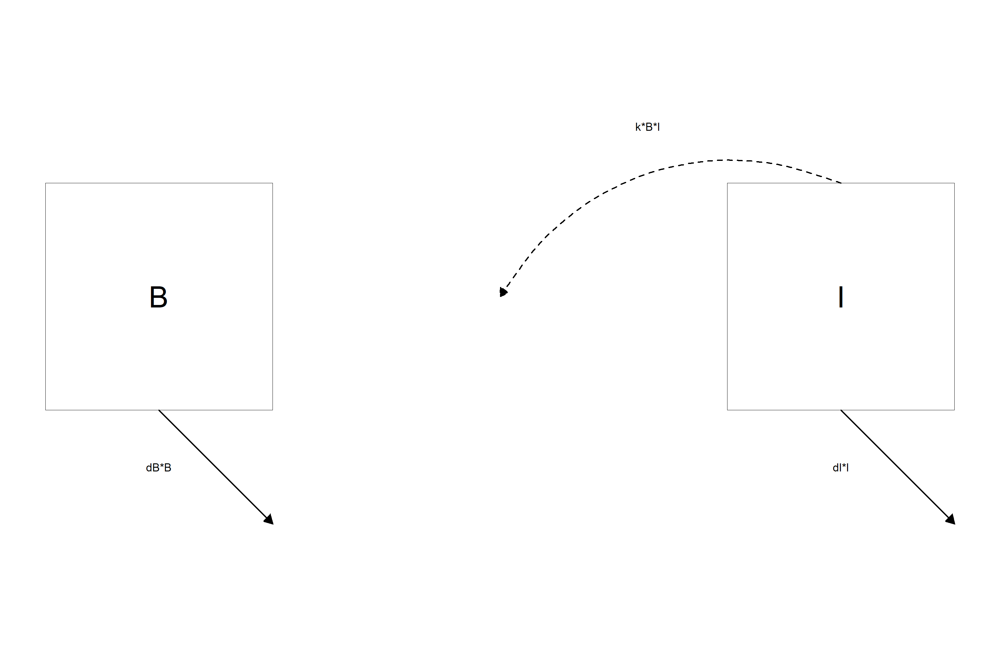

```{r, include = FALSE}
knitr::opts_chunk$set(
  collapse = TRUE,
  comment = "#>"
)

# avoid check where vignette filename must equal the vignette title
options(rmarkdown.html_vignette.check_title = FALSE)
```

```{r setup, include = FALSE}
pkg = 'flowdiagramr' #so we can easily switch names
library(pkg, character.only = TRUE)
```

# Overview

**`r pkg`** is designed to create nice-looking diagrams for compartmental simulation models and other kinds of scenarios where a model with compartments/nodes and flows/connections is needed. The user provides the compartments and the flows, and gets as return a model diagram in ggplot format, as well as code that created the diagram and can be further modified.


# Terminology

The kinds of models and diagrams we are discussing here are used in many different areas of science. That also means there are many different ways and terminology to describe these models. What we mainly refer to as _compartments_ or _variables_ is also known as _stocks_ or _nodes_. Similarly, what we mainly refer to as _flows_ or _processes_ is also known as _connections_ or ... We hope by showing examples it will be clear.


# Starting Example

Here is a simple example to illustrate the process. Let's assume we have a simple Susceptible-Infected-Recovered model, which is the starting point for a lot of infectious disease models. In this case, we have 3 compartments, name susceptible individuals, **S**, infected/infectious individuals, **I**, and recovered/removed individuals, **R**. We also have 2 processes/flows, one process by which susceptible individuals become infected at some rate after contact with infectious individuals, __b\*S\*I__ and a process by which infected individuals recover at some rate, __g\*I.__

Written out as differential equations, the model looks like this

$$
\begin{aligned}
\dot S & = - b S I \\ 
\dot I & = b S I - g I \\
\dot R & = g I 
\end{aligned}
$$

A diagram for the model looks as follows

```{r sirdiagram,  fig.cap='',  echo=FALSE, out.width = "70%"}
knitr::include_graphics('sirdiagram.png')
```

Here is how you can use **`r pkg`** to create this diagram.

## Specify the model

**`r pkg`** wants the model input as a simple list structure. This list has 3 elements, the variable/compartment labels, optional their full-text names, and the processes/flows for each compartment. For the model above, this structure would look as follows:

```{r}
varlabels = c("S","I","R")
varnames = c("Susceptible","Infected","Recovered")
flows = list(S_flows = c("-b*S*I"), 
                I_flows = c("b*S*I","-g*I"), 
                R_flows = c("g*I"))
mymodel = list(varlabels = varlabels, varnames = varnames, flows = flows)
```

Note that the main list (called `mymodel` above) can have any name, but the elements inside the list need to be called `varlabels`, `varnames` and `flows`. The `varnames` entry is optional. Also, the flows for each variable need to be named `X_flows` where X corresponds to the variable label (this doesn't have to be a single letter). Finally, the flows need to be provided as valid mathematical expressions, so you need to write `b*S*I`, writing it as `bSI` will not work.

## Create elements needed for diagram generation

Once you have placed your model into a simple structure like the one above, you can start preparing the diagram generation. 
This happens in two steps (which as the advantage of easier manual modification, see below). First, you create a set of data frames that are used as input into the actual diagram plotting code. You do this as follows:

```{r}
input_structure <- prepare_diagram(mymodel)
```

The `input_structure` object contains a list of data frames used by the actual diagram generation code. We'll skip over this for now, you can learn more about it and how to manipulate it [here]().

## Make the diagram 

Now it's time to make the diagram. This is done by sending the input structure you just created to the `make_diagram` function, like so

```{r}
my_diagram <- make_diagram(input_structure)
```

`make_diagram` returns an object (here called `my_diagram`) which is a ggplot2 plot. You you can write this plot to a file or print to the screen, e.g. with

```{r, eval = FALSE}
ggplot2::ggsave("sirdiagram.png",my_diagram)
```

and

```{r}
plot(my_diagram)
```


# Another example

Here is one more example, a classical predator-prey model from Ecology (also used in e.g. immunology to model pathogen and immune response). This model has two compartments/variables. In the context of immunology, the immune response, **I**, is the predator, and the pathogen (e.g. bacteria), **B**, are the prey. We will also include the following processes/flows: 

1. Bacteria grow/divide at some maximum rate (which we label _g_) and saturate as they approach some maximum carrying capacity, _B~max~_. 
2. Bacteria die at a natural death rate (which we label _d~B~_).
3. Bacteria are killed by the immune response at some rate _k_.
4. The immune response grows proportional to the number of bacteria and itself at some rate _r_.
5. The immune response decays at some rate (which we label _d~I~_).

Written out as differential equations, the model looks like this

$$
\begin{aligned}
\dot B & = g B (1-\frac{B}{B_{max}}) - d_B B - k BI \\
\dot I & = r B I - d_I I
\end{aligned}
$$
The model diagram is as follows.

```{r predpreydiagram,  fig.cap='',  echo=FALSE, out.width = "70%"}

```


To generate the diagram, you follow the same steps as above. 
First, create the model structure

```{r}
varlabels = c("B","I")
varnames = c("Bacteria","Immunity")
flows = list(B_flows = c("+g*B*(1-B/bmax)", "-dB*B", "-k*B*I"),
             I_flows = c("+r*B*I", "-dI*I"))
mymodel = list(varlabels = varlabels, varnames = varnames, flows = flows)
```

Again, remember that all flows need to be valid mathematical expressions, i.e. if you typed them into `R`, they would work (provided you assigned numerical values to each variable and parameter).

Next, prepare the model, then create it and plot it.

```{r}
input_structure <- prepare_diagram(mymodel)
my_diagram <- make_diagram(input_structure)
plot(my_diagram)
```

In this example, we added some optional inputs to the `make_diagram` function to start customizing the model, you'll learn more about this next.


# Next steps

You just learned the basics of using **`r pkg`** to produce a diagram. The default diagram you get this way should look ok (most of the time), but it won't be great. Sometimes, the default will actually not look that great, especially if you have a complicated model. Therefore, most of the time you will likely want to make further modifications to get a diagram that looks exactly the way you want. There are different ways to do this, which are described in [this vignette](). 

```{r}
data = c("S","","R",
          "","I","")
varlabels = matrix(data,nrow = 2, byrow = TRUE)
```
