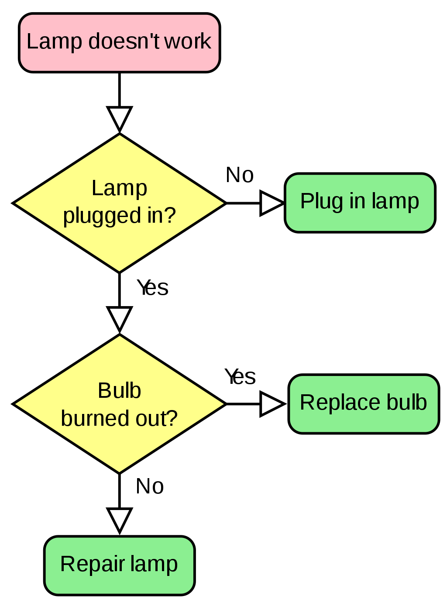

```{r, include = FALSE}
knitr::opts_chunk$set(
  collapse = TRUE,
  comment = "#>",
  fig.width = 7
)

# avoid check where vignette filename must equal the vignette title
options(rmarkdown.html_vignette.check_title = FALSE)
```

```{r setup, include = FALSE}
pkg = 'flowdiagramr' #so we can easily switch names
library(pkg, character.only = TRUE)
```

# Overview

While the main reason for the existence of **`r pkg`** is to create nice-looking diagrams for compartmental simulation models, it is possible to create other, more general flow charts. Basically, anything that can be drawn as a set of nodes/boxes and interactions/arrows can be created. This vignette gives a few brief examples to illustrate the use of the package for making general flow diagrams. The possibilities are of course endless, hopefully the following examples give you ideas on how to do things.

We are assuming that you read through the other vignettes describing the various ways to modfiy diagrams. We'll therefore do a few modifications here but won't explain things. The main purpose is to show a few diagrams that are not based on models.


# Example 1

As of this writing, the [Wikipedia Flowchart page](https://en.wikipedia.org/wiki/Flowchart) has the following as an example of a simple flow chart.


```{r,  echo=FALSE, fig.cap='[svg by Booyabazookaoriginal png by Wapcaplet](https://commons.wikimedia.org/w/index.php?curid=714537)/Wikipedia', out.width = '40%', fig.align='center'}

```

We'll try to recreate a simplified version of this. First, we'll specify the model.
The model here is not a dynamical systems model like the ones we have looked at so far. Nevertheless, as long as it can be represented as a combination of variables/compartments/nodes, and flows/transitions between those, we can use `r pkg` to draw the diagram.

Here is how you can implement this model.

```{r}
mymodel = list(varlabels = c("L","P","B","Pl","R","Re"),
                flows = list(L_flows = c("-L"), 
                             P_flows = c("L","-no_P","-yes_P"), 
                             B_flows = c("yes_P","-yes_B", "-no_B"),
                             Pl_flows = c("no_P"),
                             R_flows = c("yes_B"),
                             Re_flows = c("no_B")
                            )
                )
model_settings = list(varlocations = matrix(data = c("L", "",
                                                     "P", "Pl",
                                                     "B", "R", 
                                                     "Re","" ), ncol = 2, byrow = TRUE))
```

Note that to make the diagram logic work, we have to define actual flows. For instance we can't just label the various flows with "Yes" or "No" like in the original diagram. If we did this, **`r pkg`** wouldn't know with which boxes/variables to associate the arrows with.   


Now, it's the standard steps of preparing, making and plotting the diagram.

```{r, fig.height = 5}
diagram_list <- prepare_diagram(mymodel,model_settings)
diagram_settings <- list(var_label_text = c("Lamp doesn't work","Lamp plugged in?","Bulb burned out?","Plug in lamp","Replace bulb","Repair lamp"),
                       var_label_size = 6)
my_diagram <- make_diagram(diagram_list, diagram_settings = diagram_settings)
plot(my_diagram)
```

This looks somewhat similar to the original, but of course not quite as good. We can get fairly close with a few adjustments.

```{r, fig.height = 5}
modified_diagram_list <- diagram_list

# update the flow labels
modified_diagram_list$flows$label <- c("", "Yes", "No", "Yes", "No")

# apply some styling
diagram_settings <- list( var_fill_color = c("pink", "yellow", "yellow",
                                              "green", "green", "green"),
                          var_outline_color = "black",
                          var_label_text = c("Lamp doesn't work","Lamp plugged in?","Bulb burned out?","Plug in lamp","Replace bulb","Repair lamp"),
                          var_label_color = "black",
                          var_label_size = 3,
                          main_flow_label_size= 4
)
# make and plot diagram
my_diagram <- make_diagram(
  modified_diagram_list, 
   diagram_settings = diagram_settings)
plot(my_diagram)
```

That looks pretty good. If you want to change the shapes of the boxes, you'll need to adjust the ggplot code, following the instructions of the []().


# Example 2

TO COME. WANT TO SHOW SOME COMPLEX ONE WITH FEEDBACK LOOPS. IDEAS? MAYBE A (SIMPLE) FOOD WEB FROM ECOLOGY?


