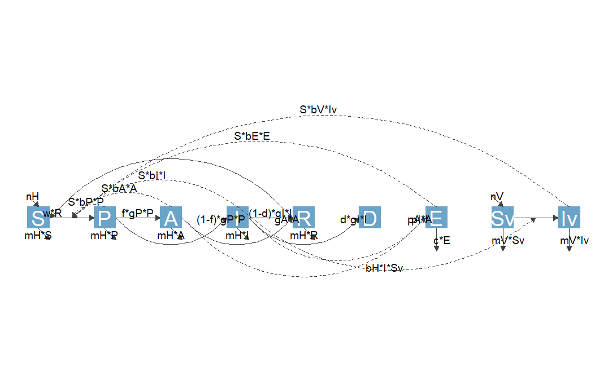
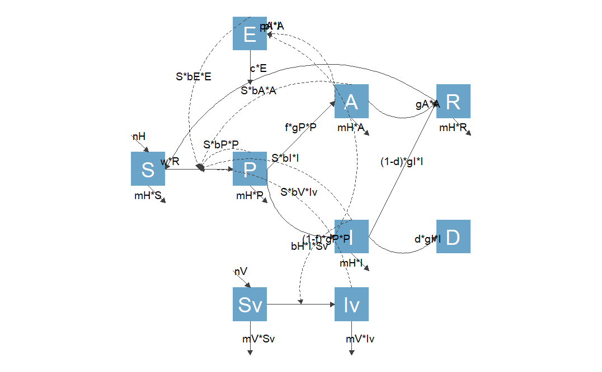

```{r, include = FALSE}
knitr::opts_chunk$set(
  collapse = TRUE,
  comment = "#>"
)

# avoid check where vignette filename must equal the vignette title
options(rmarkdown.html_vignette.check_title = FALSE)
```

```{r setup, include = FALSE}
pkg = 'flowdiagramr' #so we can easily switch names
library(pkg, character.only = TRUE)
```


## Overview

In this vignette, we discuss a few additional topics that might be of interest to some, but likely not all users.


## Using modelbuilder models with flowdiagramr

The developers of **`r pkg`** have also been developing an R package called [**modelbuilder**](https://ahgroup.github.io/modelbuilder/) which allows users to graphically build and analyze compartmental simulation models. In fact, **`r pkg`** started as a function inside `modelbuilder` to draw diagrams of user-built models. At some point, we decided to make **`r pkg`** a stand-alone package. But it still works with and is used by **modelbuilder**. If you use **modelbuilder** and want to use **`r pkg`** to generate a diagram for that model outside the auto-generated one shown inside **modelbuilder**, here are the steps.


### Model conversion

Once you built a model with **modelbuilder**, you can save it as an `Rds` file. This file contains a single object, the user-created model specified as a list object.
Since **modelbuilder** models and **`r pkg`** models are slightly different, we provide a convenience function that converts one format into the other. 

This is a very simple process, and is done with the function `convert_from_modelbuilder`. This function takes as input the modelbuilder object and produces a list that conforms to the **`r pkg`** model specification. The following examples illustrate this.

### Example 1

Assume you built a basic SIR model with **modelbuilder** and saved it as an `R` object inside a `.Rds` file. 
First, we load the file and assign it to some variable.

```{r}
mbmodel <- readRDS('SIR_model.Rds')
```

Next, we convert the object.

```{r}
mymodel <- convert_from_modelbuilder(mbmodel)
```

If you print the content, you can see it has the structure needed for **`r pkg`**. 

```{r}
print(mymodel)
```

You can now proceed with the usual steps.

```{r}
diagram_list <- prepare_diagram(mymodel)
my_diagram <- make_diagram(diagram_list)
plot(my_diagram)
```

### Example 2

Just to show one more example, this is a model from the **modelbuilder** example library called `Complex ID control`. It is a model that includes a good number of details and allows exploration of different intervention strategies. If you are not too familiar with compartmental models yet, just consider it as an example that illustrates the work flow. You can find some more details about the model in the [**modelbuilder**](https://ahgroup.github.io/modelbuilder/) package, or even more details in another of our packages, [DSAIDE](https://ahgroup.github.io/DSAIDE/), which is targeted toward learning about such infectious disease models.

First, we load the model, then convert it and print it.

```{r}
mbmodel <- readRDS('Complex_ID_Control.Rds')
mymodel <- convert_from_modelbuilder(mbmodel)
print(mymodel)
```

As promised, this is a much more complex model. We don't expect the default diagram for this model to look great, but let's give it a try. 
Instead of directly plotting it, we are saving the diagram and loading from a file, otherwise the dimensions will look too squished.


```{r}
diagram_list <- prepare_diagram(mymodel)
my_diagram <- make_diagram(diagram_list)
```


```{r, eval=FALSE}
ggplot2::ggsave('Complex_ID_Control.png',my_diagram)
```

```{r,  echo=FALSE, fig.cap='', out.width = '80%', fig.align='center'}

```

The diagram is not ideal. But you now know how to make it better, once you have done the model conversion, you can use the usual approaches.
As an example, let's specify the layout for the variables/nodes. We can do that by adding `varlocations` to the `mymodel` object.

The rationale of how to place the variables is determined by the meaning of each of them and what makes logical sense. I'm not discussing this here, if you want to learn more about the model, see the _Complex Control Scenarios_ app inside [DSAIDE](https://ahgroup.github.io/DSAIDE/).

```{r}
model_settings = list(varlocations = matrix(data = c("","E","","",
                                      "", "", "A", "R",
                                      "S", "P", "", "",
                                      "", "", "I", "D",
                               "", "Sv", "Iv", ""), nrow = 5, byrow = TRUE)
                      )
```

**TO DO**. I'm also showing the compartment names instead of their labels to make things a bit clearer.

```{r}
diagram_list <- prepare_diagram(mymodel)
my_diagram <- make_diagram(diagram_list)
```

```{r, eval=FALSE}
ggplot2::ggsave('Complex_ID_Control2.png',my_diagram)
```

```{r,  echo=FALSE, fig.cap='', out.width = '80%', fig.align='center'}

```

This is better, but of course still not quite good enough. Fortunately, you have learned how to use **`r pkg`** to fairly easily turn this into a publication-quality diagram :).


## Cropping white-space from diagram plots

It is quite likely that the diagram you get back from `make_diagram` contains a good bit of white space. This is often a problem when trying to use the figure in publications.

There are different options you can use to change the white space.


